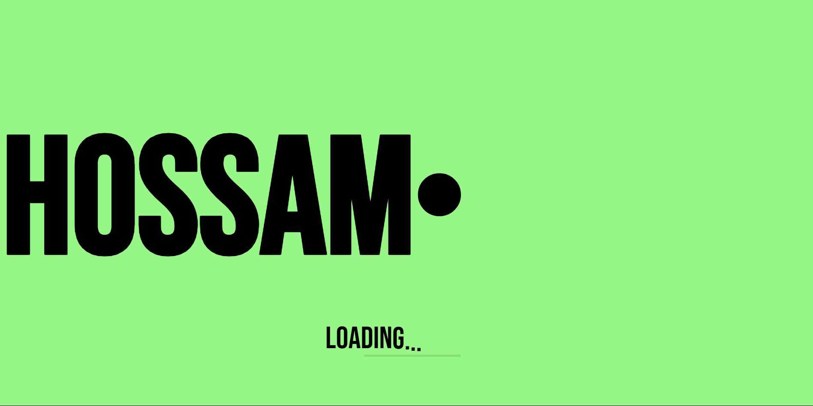
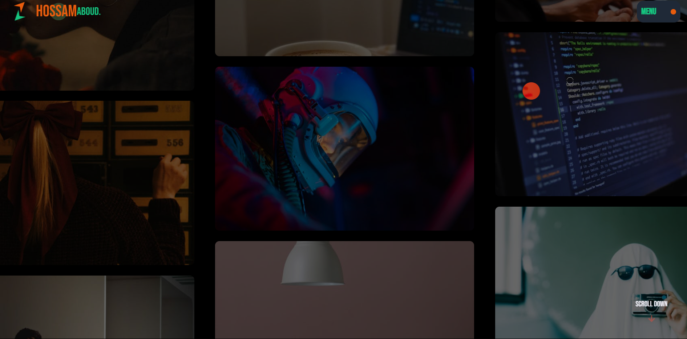
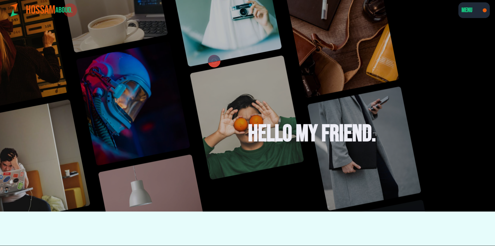
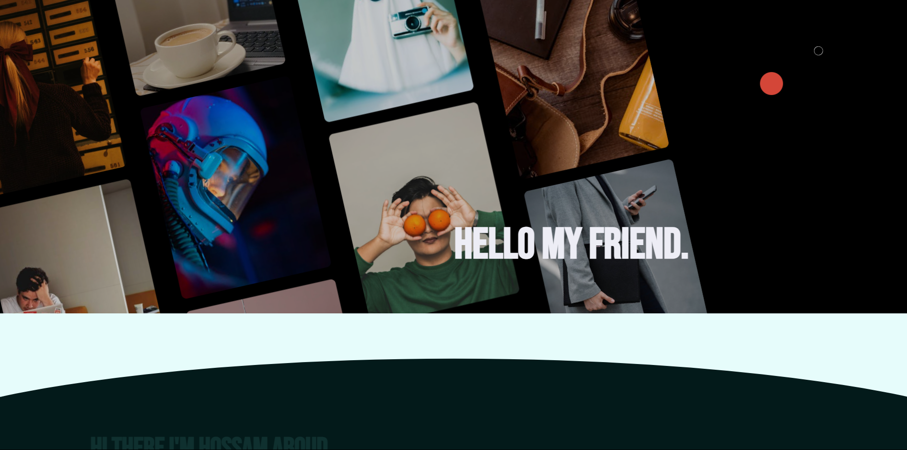
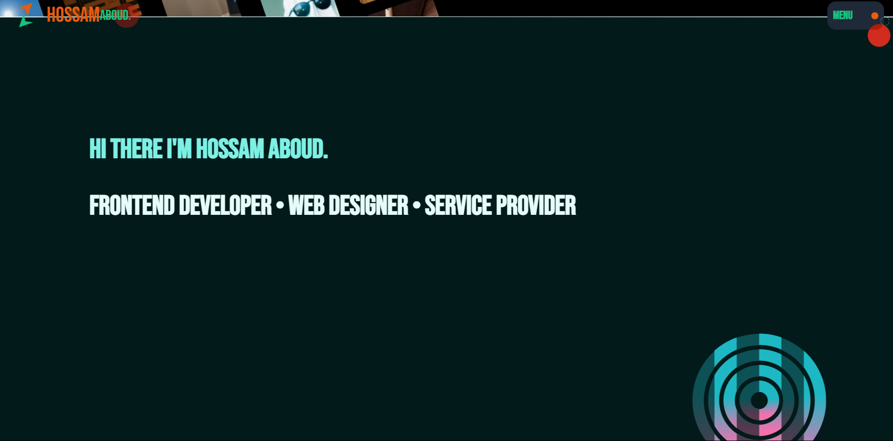
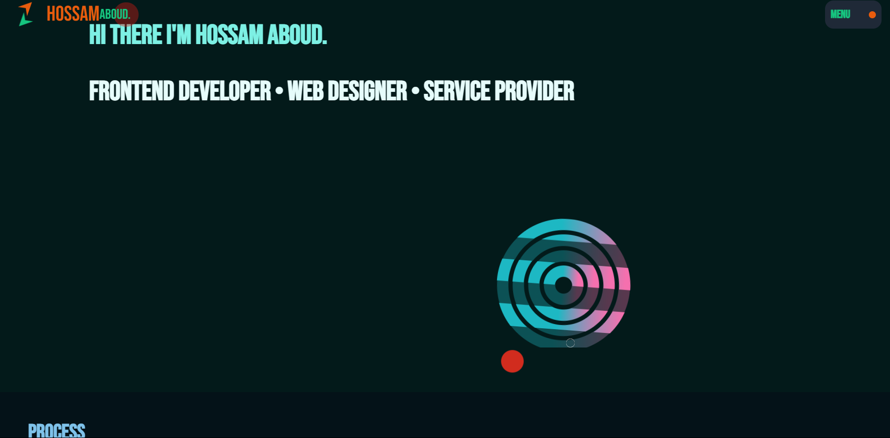
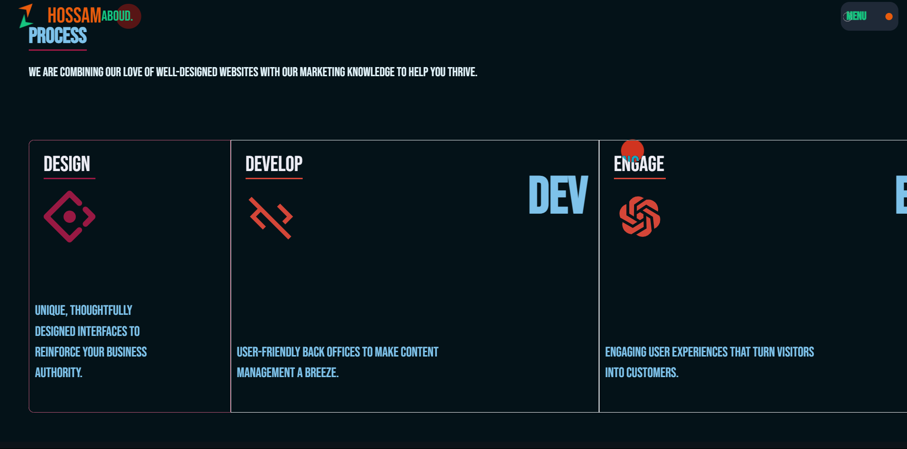
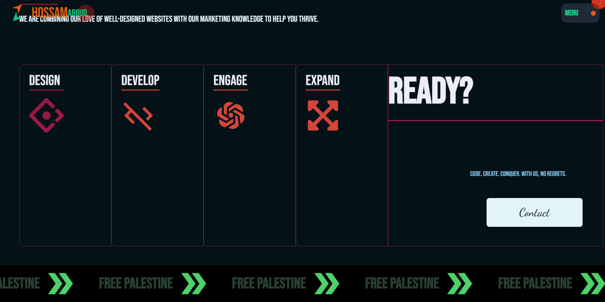

# Portf — React GSAP Portfolio

A dynamic and animated portfolio built with **React**, **Vite**, **GSAP**, **Lenis**, and **Tailwind CSS**. The app features advanced scroll-based animations, smooth page transitions, and modular components optimized for performance and creativity.

---

## 🚀 Features

- ✨ Scroll animations with [GSAP](https://greensock.com/gsap/) & [ScrollTrigger](https://greensock.com/scrolltrigger/)
- 🎯 Smooth scrolling using [Lenis](https://lenis.studiofreight.com/)
- 🎬 Preloader animation before content loads
- 💡 Component-based architecture using React 19
- 🌐 Routing with `react-router-dom@7`
- 🎨 Styled using Tailwind CSS
- 🖱️ Custom cursor
- 📱 Fully responsive

---

## 🛠️ Technologies Used

- **React 19**
- **Vite**
- **GSAP + ScrollTrigger**
- **Lenis**
- **Tailwind CSS**
- **React Router v7**
- **React Icons**

---

## 📦 Installation

### 1. Clone the repository

```bash

git clone https://github.com/hosamaboud/portf.git
cd portf

```

### 2. Install dependencies

```bash
npm install

```
### 3. Run the development server

```bash
npm run dev

```

## 📂 Project Structure

```bash
src/
├── components/
│   ├── Home/
│   │   ├── Hero.jsx
│   │   └── CurtainEffect.jsx
│   └── Utils/
│       ├── Navigation/Navbar.jsx
│       ├── Footer/Footer.jsx
│       └── CustomCursor.jsx
├── hooks/
│   └── useLenis.js
├── layout/
│   └── MainLayout.jsx
├── page/
│   ├── Home.jsx
│   ├── About.jsx
│   ├── Projects.jsx
│   ├── Contact.jsx
│   └── Preloader.jsx
├── Context/
│   └── ContextApp.jsx
└── App.jsx

```
## 📸 Demo & Preview

Live demo: [https://portf-teal-three.vercel.app/](https://portf-teal-three.vercel.app/)









